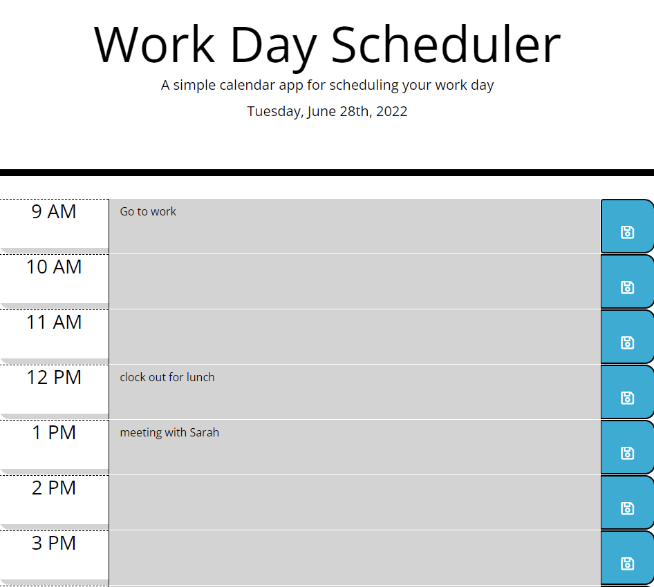

# Workday Scheduler

## Description

This workday scheduler is a simple daily planner that allows users to save events for each workday hour. 

Our week 5 challenge was use to jQuery, Bootstrap, and moment.js to create this scheduler building off the provided starter code. 

## Built With
* HTML
* CSS
* Javascript
* Bootstrap
* jQuery
* moment.js

## Preview

https://oceanlatte.github.io/workday-scheduler/